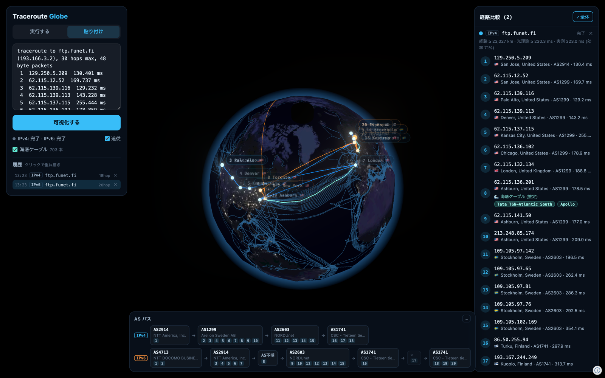
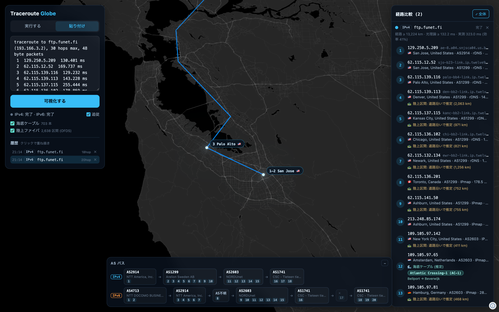

# Traceroute Globe

**[日本語版 README はこちら / Japanese README](README.ja.md)**

Visualize traceroute paths on a photorealistic 3D night globe, powered by
[Navara](https://navara.world/) — an open-source 3D map engine (Rust/WASM + Three.js).

Run a live traceroute and watch the route light up hop by hop across the planet,
compare IPv4 vs IPv6 paths side by side, and read the AS-level path at a glance.



## Features

- **Live mode** — runs `traceroute` / `traceroute6` (ICMP or UDP) behind a local
  dev server and streams hops over SSE. Each hop is geolocated, reverse-resolved,
  and drawn onto the globe in real time with a follow camera
- **Dual-stack comparison** — the "Both" option traces IPv4 and IPv6
  simultaneously and draws them in different colors. On many access networks the
  two families take completely different paths, and it shows
- **AS path strip** — hops grouped by origin AS
  (`AS2914 NTT → AS1299 Arelion → AS2603 NORDUnet → AS1741 FUNET`), with each
  block linking to [bgp.tools](https://bgp.tools)
- **Path statistics** — geodesic path length, the speed-of-light-in-fiber
  round-trip lower bound (≈ 200,000 km/s), and measured RTT with a path
  efficiency percentage
- **Paste mode** — paste output from `traceroute`, Windows `tracert`
  (English/Japanese), or `mtr --report` captured on any machine
- **History overlays** — finished traces are kept in `localStorage` (up to 20);
  click to overlay up to 4 traces in different colors for comparison
- **Router geolocation that holds up** — every hop gets up to three location
  candidates: the operator's own naming in the reverse DNS name (CLLI/IATA
  codes such as `sttlwa`, `chcgil`, `lax`, plus a few carrier-specific
  abbreviations), [RIPE IPmap](https://ipmap.ripe.net/) (RIPE Atlas latency
  measurements, IXP data, geofeeds, crowdsourcing) and a general IP database
  (ip-api). The client picks, in that order of trust, the first candidate that
  is physically consistent with the measured RTTs (speed of light in fibre ≈
  100 km per ms of RTT, checked against the origin and against the
  neighbouring hops) and flags hops that no candidate can explain
- **Submarine cables** — every submarine cable system in the world
  (TeleGeography data, ~700 systems) drawn under the route. Click a cable to see
  its name, length, RFS year and owners
- **Terrestrial fibre** — long-haul fibre routes digitised in the Open Fibre
  Data Standard (OFDS public data, 22 countries) as a separate toggleable layer.
  For overland segments with no such data the route is approximated along the
  road network (OSRM), because long-haul fibre overwhelmingly follows roads and
  railways; those segments are labelled `🛣` as estimates
- **Which cable does my packet take?** — for each intercontinental segment the
  app estimates the cable(s) most likely used (landing points near both hops,
  spanning the segment, and a segment length that matches the measured RTT
  increase), lists the top candidates in the hop panel, lights up the best one
  on the globe and draws the route along that cable's actual path. It's a
  heuristic — traceroute can't see the physical layer — so it's labeled as an
  estimate
- **Detail zoom** — NASA Black Marble for the overview, cross-fading into an
  OSM-based dark basemap (up to street level) as you zoom in. Routes are drawn
  as ground tracks in the tile pipeline, so lines and hop markers stay
  precisely connected at any zoom



## Quick start

```sh
npm install
npm run dev
```

Open the URL Vite prints (e.g. http://localhost:5173).

- **Live mode** requires macOS (it spawns the system `traceroute` /
  `traceroute6`). ICMP mode is recommended; on IPoE/DS-Lite-style access lines
  IPv4 transit hops rarely answer, so IPv6 usually shows a much better path
- **Paste mode** works anywhere. No traceroute at hand? Paste
  [docs/demo-v6.txt](docs/demo-v6.txt) or [docs/demo-v4.txt](docs/demo-v4.txt)
  (sanitized real-world traces to ftp.funet.fi)

## Reading the picture

| Element | Meaning |
| --- | --- |
| Solid line | Segment between hops with consecutive TTLs (great-circle ground track) |
| Dashed line | Segment spanning unlocatable hops (`*` timeouts, private/CGN addresses) |
| Colors | One color slot per trace: cyan → orange → violet → green |
| Large dot | Destination |
| Thin blue web | All submarine cable systems (toggle in the left panel) |
| Thin amber lines | Terrestrial fibre routes from OFDS public data (toggle) |
| Glowing teal cable | The stretch of the estimated cable the route actually uses (`🌊` in the hop panel); the route follows it. Clicking a candidate name lights up the whole system |
| Route along roads | Overland segment approximated on the road network (`🛣` in the hop panel) |

Nearby hops (< 5 km) collapse into one site, labeled like `8–9 Chiyoda City`.
The right panel lists every hop (IP, rDNS, city, ASN, RTT) — click one to fly
there. Note that IP geolocation is city-level at best and can be wrong,
especially for anycast destinations.

## How it works

```
Browser (Vite + TypeScript + @navaramap/three)
  ├─ GET /api/trace    spawn traceroute, stream hops + geo + rDNS over SSE
  ├─ POST /api/enrich  batch geolocation + rDNS for paste mode
  ├─ GET /api/self     geolocate the local egress IP (origin marker)
  ├─ GET /api/cables   proxy + cache for TeleGeography's cable GeoJSON / details
  ├─ GET /api/fiber    OFDS terrestrial fibre spans, fetched, simplified and merged
  └─ GET /api/route    road route between two points (OSRM demo server, serialised)
Server side (server/api.ts, a Vite dev-server middleware)
  ├─ geolocation: ip-api.com /batch (ASN, throttled to its 15 req/min limit)
  │  + RIPE IPmap per IP (position, 4 in flight), both cached; the client
  │  receives all candidates and resolves them against RTT
  └─ terrestrial fibre: 27 OFDS GeoJSON files (~22 MB) → Douglas–Peucker
     simplified to < 1 MB, cached on disk for a week
```

On the Navara side: Black Marble raster + an OSM dark style cross-faded by
camera altitude, clamped-to-ground GeoJSON polylines for routes and cables
(with selective bloom on the route and on highlighted cables), GeoJSON points
for hops, and DOM hop chips projected each frame via `OverlayPlugin` (hidden
behind the horizon by a camera-altitude test).

Cable inference (`src/cables.ts`): a segment qualifies if it is ≥ 600 km and
crosses a border (domestic segments are treated as terrestrial); a cable is a
candidate when one of its line endpoints lies within 350 km of each hop and those
two endpoints are far enough apart to actually span the segment. Candidates are
ranked by landing distance, span mismatch and how well the cable's path length
matches the measured RTT increase. The route follows the cable's geometry only
when the shortest path through the cable's branches is at most 1.6× the
straight-line distance — otherwise it would draw a detour that isn't the packet's
path.

This is a local tool: the dev server executes `traceroute` for whatever host the
page asks for. Don't expose it beyond localhost.

## Notes

- ip-api.com's free tier is for non-commercial use, HTTP-only (called
  server-side), and rate-limited — handled, but heavy use may still show
  "位置情報なし" temporarily
- Submarine cable data is fetched at runtime from TeleGeography's public
  Submarine Cable Map API (not redistributed in this repo) and cached by the
  dev server for 24 h. Cable attribution is shown in the map's credits
- `docs/screenshot-*.png` can be regenerated with
  `node scripts/capture-screenshots.mjs` (needs Chrome and a running dev server)

## Credits

- Map engine: [Navara](https://github.com/eukarya-inc/navara) (MIT / Apache-2.0)
- Tiles: [Re:Earth Papers](https://papers.reearth.land/attribution) — NASA Earth
  Observatory "Earth at Night 2016" (public domain) and an OSM-based dark style
  (© OpenStreetMap contributors)
- IP geolocation: [ip-api.com](https://ip-api.com)
- Submarine cable routes and details: [TeleGeography Submarine Cable Map](https://www.submarinecablemap.com/)
- Router geolocation: [RIPE IPmap](https://ipmap.ripe.net/) (RIPE NCC)
- Terrestrial fibre: [OFDS public data](https://github.com/Open-Telecoms-Data/OFDS-public-data) (Open Telecoms Data)
- Road routing for overland estimates: [OSRM](http://project-osrm.org/) demo server, © OpenStreetMap contributors

## License

[MIT](LICENSE)
